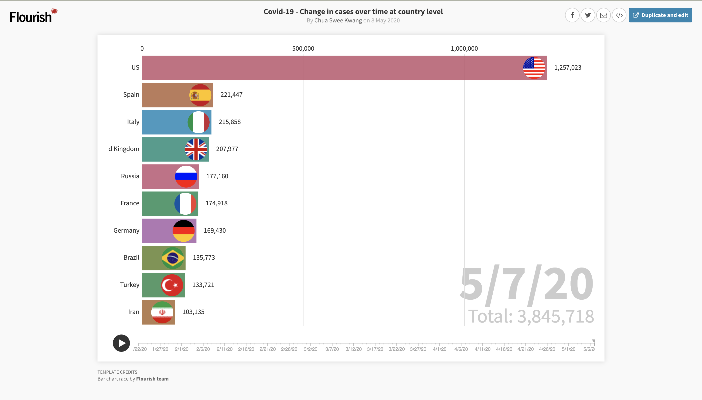
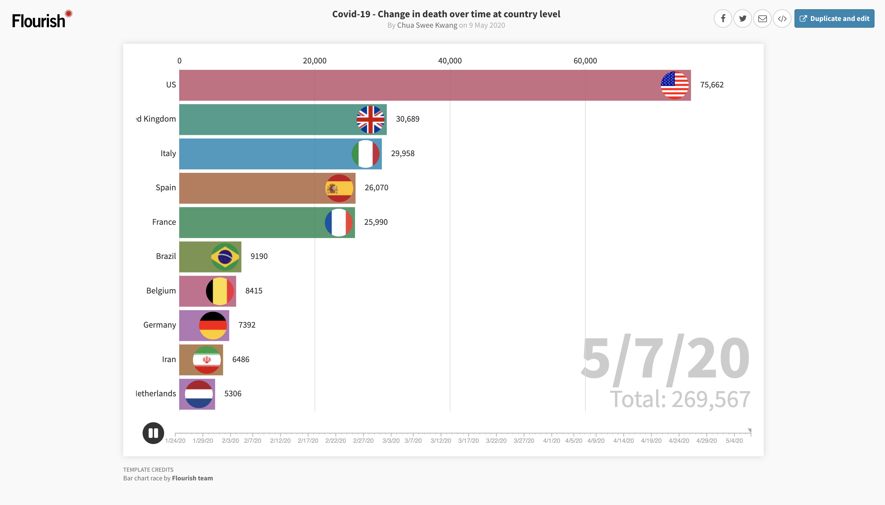

# Convid-19 Bar-Race Charts
## Change in cases and deaths over time at country level from 1/22/20 to 5/7/20

Purpose is to visualise the change in cases and deaths over time at country level using a bar-race chart.  
<b>Covid-19 - Change in cases over time at country level:</b> https://public.flourish.studio/visualisation/2306811/  
<b>Covid-19 - Change in deaths over time at country level:</b> https://public.flourish.studio/visualisation/2307205/
 
 
The dataset used is from https://www.kaggle.com/sudalairajkumar/novel-corona-virus-2019-dataset Downloaded on 8 May 2020 and alpha2 country code data from https://gist.github.com/marijn/396531/188caa065e3cd319fed7913ee3eecf5eec541918
 
 
The Data used from this bar race chart are time_series_covid_19_confirmed.csv, and time_series_covid_19_deaths.csv. The data set is separated by Province/State and so the data is transformed into change over time at country level. In order to show the flags of the country, Alpha2 country code is need because the img url is from https://www.countryflags.io/sg/flat/64.png (countryflags.io/<alpha 2 country code>/flat/64.png). So the image url is added to the dataframe. Therefore, the transformed dataframe consists of the combined rows with same country and a new columns is added for the image. The datas used to plot the graphs can be dowloaded from here (https://github.com/Sweekwang/Convid-19---Bar-Race--Change-in-cases-death-over-time-at-country-level)

       
<b>Covid-19 - Change in cases over time at country level:</b> https://public.flourish.studio/visualisation/2306811/  

<b>Covid-19 - Change in death over time at country level:</b> https://public.flourish.studio/visualisation/2307205/ 

